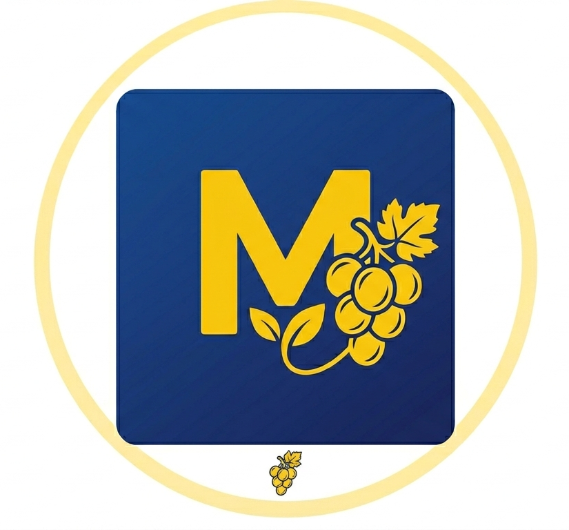

# Urbanización Moyocochita - Landing Page



## 📋 Descripción del Proyecto

Landing page moderna y responsiva para la **Urbanización Moyocochita**, un proyecto de inversión inmobiliaria estratégicamente ubicado en Camargo, Chuquisaca, Bolivia. El sitio web presenta lotes de terreno de alta plusvalía diseñados para inversión patrimonial y vivienda familiar.

### 🎯 Objetivo del Proyecto

- **Promover la venta de lotes** en la Urbanización Moyocochita
- **Informar a potenciales inversores** sobre las ventajas y beneficios de la ubicación
- **Facilitar el contacto directo** a través de WhatsApp y teléfono
- **Posicionar el proyecto** como una oportunidad de inversión segura en el sur de Bolivia
- **Alcanzar visibilidad internacional** para atraer inversores bolivianos en el exterior

## ✨ Características Principales

- 🎨 **Diseño Moderno**: Interfaz visual atractiva con efectos glass, hover y animaciones
- 📱 **Mobile First**: Diseño 100% responsivo optimizado para smartphones, tablets y desktop
- ⚡ **Next.js 14**: Framework React de última generación para máximo rendimiento
- 🎯 **SEO Optimizado**: Metaetiquetas y estructura semántica para visibilidad en buscadores
- 🔗 **Integración WhatsApp**: Contacto directo con mensajes predefinidos
- 🌐 **Multi-dispositivo**: Experiencia consistente en todos los tamaños de pantalla

## 🏗️ Stack Tecnológico

- **Framework**: Next.js 14.2.0 (App Router)
- **Lenguaje**: TypeScript 5.4.0
- **Estilos**: Tailwind CSS 3.4.0
- **Iconos**: Font Awesome 6.0.0
- **Fuente**: Plus Jakarta Sans (Google Fonts)
- **Despliegue**: DevContainer (Docker)

## 🚀 Instalación y Ejecución

### Prerrequisitos

- Node.js 20.x o superior
- npm o yarn
- Docker (para DevContainer)

### Instalación

```bash
# Clonar el repositorio
git clone <repository-url>
cd Moyocochita-landingPage

# Instalar dependencias
npm install

# Ejecutar en modo desarrollo
npm run dev

# Construir para producción
npm run build

# Iniciar servidor de producción
npm start
```

El servidor estará disponible en `http://localhost:3010`

## 📁 Estructura del Proyecto

```
Moyocochita-landingPage/
├── public/                      # Archivos estáticos
│   └── urbanizacion-moyocochita.png
├── src/
│   ├── app/                     # App Router de Next.js
│   │   ├── globals.css         # Estilos globales
│   │   ├── layout.tsx          # Layout principal
│   │   └── page.tsx            # Página principal
│   └── components/              # Componentes React
│       ├── Navbar.tsx          # Navegación con menú móvil
│       ├── HeroSection.tsx     # Sección hero principal
│       ├── TrustStats.tsx      # Estadísticas de confianza
│       ├── BenefitsSection.tsx # Beneficios de inversión
│       ├── GallerySection.tsx  # Galería de lotes
│       ├── Footer.tsx          # Footer con contactos
│       └── WhatsAppFloat.tsx   # Botón flotante WhatsApp
├── .devcontainer/              # Configuración DevContainer
├── Modelos-base/               # Modelos de referencia HTML
└── README.md                   # Este archivo
```

## 🎨 Componentes

### Navbar
- Navegación fija con efecto glass
- Menú hamburguesa responsivo para móviles
- Efecto de scroll con sombra dinámica

### HeroSection
- Imagen de fondo con gradiente overlay
- Call-to-action con efecto shine
- Badge de disponibilidad inmediata

### TrustStats
- 4 estadísticas clave del proyecto
- Grid responsivo (1-4 columnas)
- Cards con hover effect

### BenefitsSection
- 3 beneficios principales de inversión
- Iconos Font Awesome
- Cards con animación hover

### GallerySection
- Imagen del plano de lotes
- Lista de características numeradas
- Layout responsivo (imagen/texto)

### Footer
- Cita inspiradora
- Tarjetas de contacto (WhatsApp/Teléfono)
- Enlaces a redes sociales

## 🔧 Configuración

### DevContainer

El proyecto incluye configuración de DevContainer para un entorno de desarrollo consistente:

```bash
# Abrir en DevContainer (VS Code)
# La configuración está en .devcontainer/devcontainer.json
```

### Tailwind CSS

Configuración personalizada en `tailwind.config.ts` con colores de marca y fuentes personalizadas.

## 📱 Responsive Design

El sitio sigue el enfoque **Mobile First**:

- **Smartphones (< 640px)**: 1 columna, texto reducido, menú hamburguesa
- **Tablets (640px - 768px)**: 2 columnas, texto medio
- **Desktop (> 768px)**: 3-4 columnas, texto completo, navegación completa

## 🌍 SEO y Visibilidad

### Metaetiquetas

```typescript
title: "Urbanización Moyocochita | Inversión en Camargo"
description: "Lotes de terreno en Camargo, Chuquisaca. Listos para invertir y vivir en la Urbanización Moyocochita."
```

### Palabras Clave

- Lotes de terreno Camargo
- Inversión inmobiliaria Bolivia
- Urbanización Moyocochita
- Terrenos Chuquisaca
- Plusvalía inmobiliaria
- Bienes raíces Bolivia

### Estrategia SEO

- Estructura semántica HTML5
- Meta descripciones optimizadas
- URLs amigables
- Imágenes con alt text
- Performance optimizada (Core Web Vitals)
- Mobile-friendly design

## 👨‍💻 Desarrollador

**Edgar Mercado Garcia**
- 💼 Desarrollador Full Stack
- 📍 Bolivia
- 🎯 Especialista en React, Next.js y TypeScript

### 📞 Contacto

- 📱 **WhatsApp**: [+59170203103](https://wa.me/59170203103?text=Hola%20Edgar,%20me%20interesa%20contactarte%20por%20el%20proyecto%20Moyocochita)
- 📧 **Email**: [dev.emercado@gmail.com](mailto:dev.emercado@gmail.com)

## 📄 Licencia

Este proyecto es propiedad de Urbanización Moyocochita. Todos los derechos reservados © 2026.

## 🙏 Agradecimientos

- Next.js team por el excelente framework
- Tailwind CSS por el sistema de utilidades
- Font Awesome por los iconos
- Google Fonts por tipografías de calidad

---

**Desarrollado con ❤️ por Edgar Mercado Garcia**

¿Interesado en colaborar o necesitas un proyecto similar? [Contáctame](https://wa.me/59170203103) 🚀
